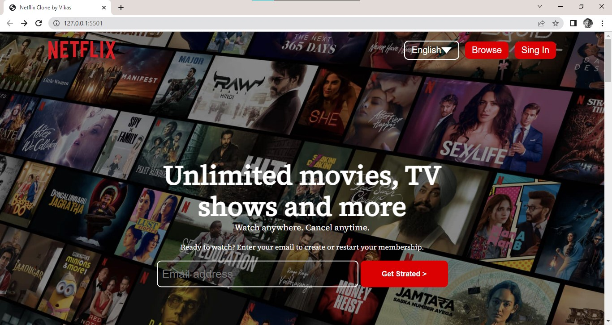
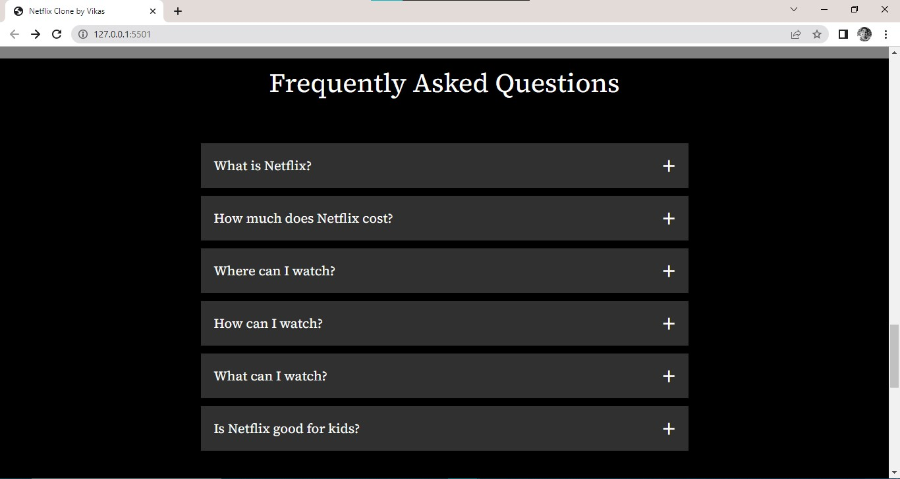
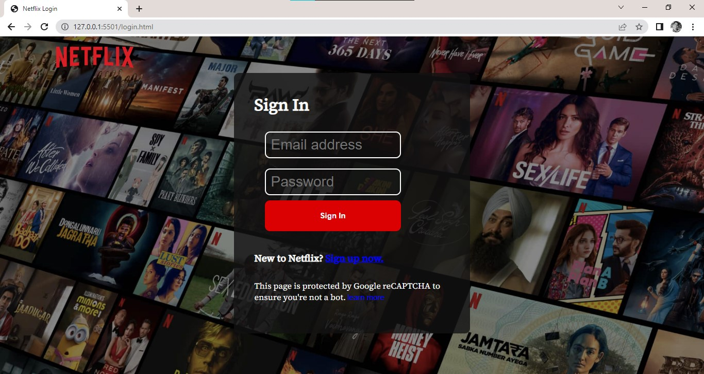
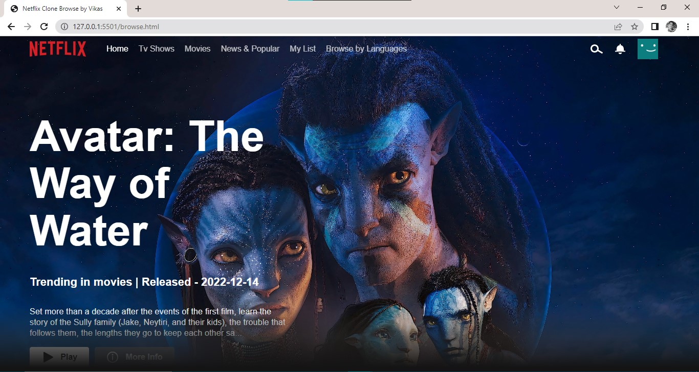
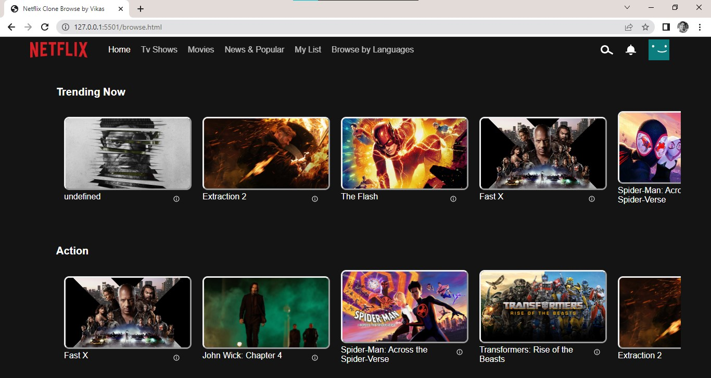

# project-documentation

<p align="center">
  <a href="" rel="noopener">
 </a>
</p>

<h3 align="center">Netflix Clone using HTML CSS and JavaScript</h3>

<div align="center">

  []() 
  [](https://github.com/kylelobo/The-Documentation-Compendium/issues)
  [](https://github.com/kylelobo/The-Documentation-Compendium/pulls)
  [](/LICENSE)

</div>

---

<p align="center"> Few lines describing your project.
    <br> 
</p>

## 📝 Table of Contents
- [About](#about)
- [Getting Started](#getting_started)
- [Usage](#usage)
- [Screenshot](#screenshot)
- [Features](#features)
- [Authors](#authors)
- [Acknowledgments](#acknowledgement)

## 🧐 About <a name = "about"></a>

This is a project to create a Netflix Clone website using HTML, CSS, and JavaScript. The website looks similar to the original Netflix and uses some of its functionalities

## 🏁 Getting Started <a name = "getting_started"></a>
These instructions will get you a copy of the project up and running on your local machine for development and testing purposes. See [deployment](#deployment) for notes on how to deploy the project on a live system.

### Prerequisites
You need to install the software and extensions.

```
Visual Studio Code
```
```
Live Server
```
```
JavaScript
```
```
HTML and CSS
```

## 🎈 Usage <a name="usage"></a>

To view the website, you can open the index.html file in your browser. Alternatively, you can use a live server extension in your code editor to view the website.

## 🎈 Screenshots <a name="screenshots"></a>

<p align="center">
  <a href="" rel="noopener">
 </a>
</p>
<p align="center">
  <a href="" rel="noopener">
 </a>
</p>
<p align="center">
  <a href="" rel="noopener">
 </a>
</p>
<p align="center">
  <a href="" rel="noopener">
 </a>
</p>
<p align="center">
  <a href="" rel="noopener">
 </a>
</p>


## 🎈 Features <a name="features"></a>

- Responsive layout for desktop and mobile devices.
- Header with Netflix logo, navigation menu, and search bar.
- Main section with featured TV shows/movies and categories.
- Hover effect on TV shows/movies with trailers.
- Footer with social media links and disclaimer.

## 🚀 Deployment <a name = "deployment"></a>

Deploy this on a live system with the Visual Studio code extension live server.

## ⛏️ Built Using <a name = "built_using"></a>
- [HTML](https://html.com/) 
- [CSS](https://www.w3schools.com/css/) 
- [JavaScript](https://www.javascript.com/)
- [TMDB API](https://developer.themoviedb.org/) 

## ✍️ Authors <a name = "authors"></a>
- [@kylelobo](https://github.com/2211Vikas) - Idea & Initial work


## 🎉 Acknowledgements <a name = "acknowledgement"></a>
- Hat tip to anyone whose code was used
- Inspiration
- References
